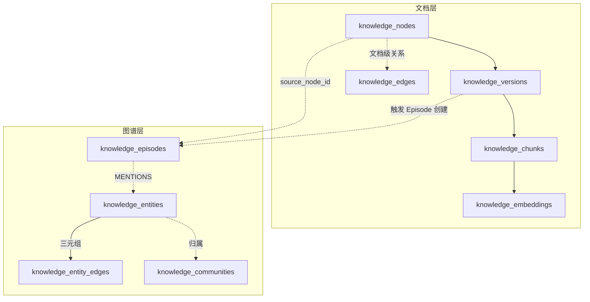
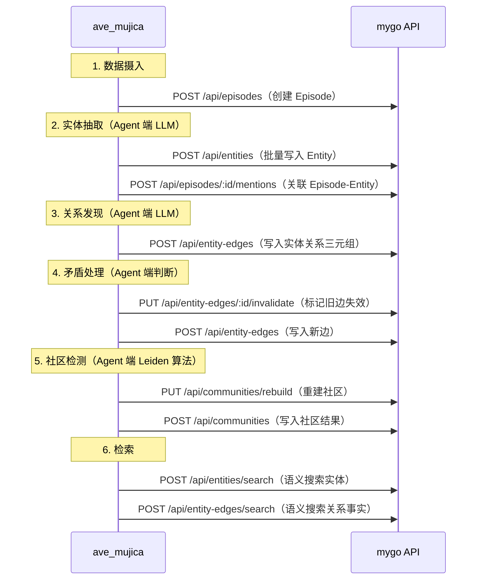

# 知识库数据库 Schema 设计文档（Knowledge Node 方案）

## 1. 设计背景与目标

mygo 定位为 **Data Plane Service for AI Agent**，为外部 Agent（ave_mujica）提供高并发的数据存储、CRUD 和向量检索。数据库设计需要满足以下要求：

* **Knowledge-first，而非 Blog-first**
* 支持 Markdown 作为人类可编辑的知识源
* 支持 AI 消费（Chunk / Embedding 存储与向量检索）
* 支持知识之间的显式关系（Knowledge Graph）
* 在单机 PostgreSQL 环境下即可稳定运行，并可平滑演进

在命名与建模上，系统采用 **Knowledge Node（知识节点）** 作为顶层抽象，避免 `entity / post / document` 等易产生歧义的概念。

---

## 2. 核心设计原则

### 2.1 命名原则

* 避免与 DDD、ORM、AI 中已有高频术语冲突
* 数据表命名直接反映知识系统语义
* 为未来知识图谱（Graph）与 Agent 推理预留空间

### 2.2 权责划分

* **PostgreSQL**：权威事实来源（Schema / Markdown 快照 / Embedding）
* **文件系统**：编辑友好型源文件、恢复与工具支持
* **Redis（可选）**：缓存、异步任务加速

### 2.3 主键设计（自增 ID + 业务 UUID）

所有核心表均采用 **双 ID 设计**：

| ID 类型 | 字段名 | 用途 |
|--------|-------|------|
| 自增主键 | `id` (BIGSERIAL) | 数据库内部主键，聚簇索引，JOIN 性能优化 |
| 业务 UUID | `node_id` / `version_id` 等 | 对外暴露的唯一标识，API 参数，跨系统引用 |

**设计优势**：

* **性能更好**：整型主键作为聚簇索引，B+ 树更紧凑
* **安全性**：避免暴露自增 ID 导致的信息泄露（可猜测数量）
* **一致性**：与 User 模块保持统一设计风格
* **灵活性**：UUID 可用于分布式场景，自增 ID 保证本地性能

---

## 3. 数据模型总览

### 3.1 文档层（Document Layer）

| 层级        | 表名                             | 作用               |
| --------- | ------------------------------ | ---------------- |
| 知识顶层      | `knowledge_nodes`              | 知识系统中的顶层节点       |
| 内容版本      | `knowledge_versions`           | Markdown 的权威版本快照 |
| AI 单元     | `knowledge_chunks`             | AI 处理的最小单元       |
| 语义向量      | `knowledge_embeddings`         | Chunk 对应的向量表示    |
| 文档关系      | `knowledge_edges`              | 知识节点之间的关系（增强版）   |
| 辅助分类      | `tags` / `knowledge_node_tags` | 弱语义标签            |
| AI 任务（可选） | `ai_tasks`                     | AI 处理任务追踪        |

### 3.2 图谱层（Graph Layer）—— 受 Graphiti 启发

> 参考 [Zep/Graphiti](https://github.com/getzep/graphiti) 的时序知识图谱架构，引入实体级图谱、数据溯源和社区聚类能力。
> mygo 仅负责这些数据的存储和检索（Data Plane），实体抽取、关系发现、社区检测等 Intelligence 逻辑由 ave_mujica 负责。

| 层级       | 表名                               | 作用                         |
| -------- | -------------------------------- | -------------------------- |
| 数据溯源     | `knowledge_episodes`             | 数据摄入事件记录（provenance）       |
| 实体节点     | `knowledge_entities`             | 从文档中抽取的实体（人/概念/技术/事件等）     |
| 实体关系     | `knowledge_entity_edges`         | 实体间的语义关系（三元组），支持双时态        |
| 溯源关联     | `knowledge_episode_mentions`     | Episode 与 Entity 的关联（MENTIONS） |
| 社区聚类     | `knowledge_communities`          | 实体的层次化社区分组                 |
| 社区成员     | `knowledge_community_members`    | 社区与实体的归属关系                 |

### 3.3 两层模型的关系



**关键设计决策**：

* **文档层**：以 Knowledge Node（完整 Markdown）为中心，服务于人类阅读和内容管理
* **图谱层**：以 Entity（实体三元组）为中心，服务于 AI 推理和知识检索
* **桥梁**：Episode 作为数据摄入事件，连接文档层和图谱层，提供完整的数据溯源链

---

## 4. 表结构设计说明

本节在概念说明的基础上，**给出对应的 PostgreSQL DDL**，作为该知识系统的权威数据库定义。

---

### 4.1 knowledge_nodes —— 知识节点（核心表）

**语义定位**：

> 知识图谱中的一个节点，是所有知识内容的根抽象。

**字段说明**：

| 字段              | 类型          | 说明                                             |
| --------------- | ----------- | ---------------------------------------------- |
| id              | BIGSERIAL   | 数据库自增主键（内部使用）                                  |
| node_id         | UUID        | 知识节点的业务唯一标识（对外暴露）                              |
| node_type       | VARCHAR(32) | 节点类型，用于区分知识形态（blog / note / paper / concept 等） |
| title           | TEXT        | 面向人类的知识标题，允许自由修改                               |
| summary         | TEXT        | 短摘要，可由 AI 自动生成或人工维护                            |
| status          | VARCHAR(16) | 知识状态（draft / published / archived）             |
| confidence      | REAL        | 对该知识结论的主观置信度（0–1），服务于研究型知识                     |
| current_version | INT         | 当前生效的 Markdown 版本号                             |
| created_at      | TIMESTAMP   | 节点创建时间                                         |
| updated_at      | TIMESTAMP   | 节点最近一次元信息更新                                    |

**典型 node_type**：

* `blog`
* `note`
* `paper`
* `concept`
* `experiment`
* `code`

**DDL**：

```sql
CREATE TABLE knowledge_nodes (
    id BIGSERIAL PRIMARY KEY,
    node_id UUID NOT NULL UNIQUE,
    node_type VARCHAR(32) NOT NULL,
    title TEXT NOT NULL,
    summary TEXT,
    status VARCHAR(16) DEFAULT 'draft',
    confidence REAL,
    current_version INT NOT NULL DEFAULT 1,
    created_at TIMESTAMP NOT NULL DEFAULT NOW(),
    updated_at TIMESTAMP NOT NULL DEFAULT NOW()
);

CREATE INDEX idx_knowledge_nodes_type ON knowledge_nodes(node_type);
CREATE INDEX idx_knowledge_nodes_status ON knowledge_nodes(status);
```

---

### 4.2 knowledge_versions —— Markdown 版本表

**语义定位**：

> Markdown 内容的权威快照（Source of Truth）。

**字段说明**：

| 字段         | 类型        | 说明                   |
| ---------- | --------- | -------------------- |
| id         | BIGSERIAL | 数据库自增主键（内部使用）        |
| version_id | UUID      | 版本记录业务唯一标识（对外暴露）     |
| node_id    | UUID      | 所属知识节点业务 UUID         |
| version    | INT       | 版本号，从 1 开始单调递增       |
| content_md | TEXT      | 完整 Markdown 内容（权威文本） |
| created_at | TIMESTAMP | 该版本生成时间              |

**DDL**：

```sql
CREATE TABLE knowledge_versions (
    id BIGSERIAL PRIMARY KEY,
    version_id UUID NOT NULL UNIQUE,
    node_id UUID NOT NULL,
    version INT NOT NULL,
    content_md TEXT NOT NULL,
    created_at TIMESTAMP NOT NULL DEFAULT NOW(),
    UNIQUE(node_id, version)
);

CREATE INDEX idx_knowledge_versions_node ON knowledge_versions(node_id);
```

---

### 4.3 knowledge_chunks —— 知识分块表

**语义定位**：

> AI 处理的最小单元（Embedding / RAG / Reasoning）。

**字段说明**：

| 字段           | 类型        | 说明                         |
| ------------ | --------- | -------------------------- |
| id           | BIGSERIAL | 数据库自增主键（内部使用）              |
| chunk_id     | UUID      | Chunk 业务唯一标识（对外暴露）         |
| node_id      | UUID      | 所属知识节点业务 UUID               |
| version      | INT       | 来源的 Markdown 版本号           |
| heading_path | TEXT      | 该 Chunk 所属的标题层级路径（如 H1/H2） |
| content      | TEXT      | Chunk 的纯文本内容               |
| token_count  | INT       | 该 Chunk 的 Token 数（用于模型预算）  |
| chunk_index  | INT       | 在同一版本中的顺序编号                |
| created_at   | TIMESTAMP | Chunk 创建时间                 |

**DDL**：

```sql
CREATE TABLE knowledge_chunks (
    id BIGSERIAL PRIMARY KEY,
    chunk_id UUID NOT NULL UNIQUE,
    node_id UUID NOT NULL,
    version INT NOT NULL,
    heading_path TEXT,
    content TEXT NOT NULL,
    token_count INT,
    chunk_index INT,
    created_at TIMESTAMP DEFAULT NOW()
);

CREATE INDEX idx_knowledge_chunks_node ON knowledge_chunks(node_id);
CREATE INDEX idx_knowledge_chunks_version ON knowledge_chunks(node_id, version);
```

---

### 4.4 knowledge_embeddings —— 向量表

**语义定位**：

> Chunk 的语义向量表示。

**字段说明**：

| 字段         | 类型          | 说明                      |
| ---------- | ----------- | ----------------------- |
| id         | BIGSERIAL   | 数据库自增主键（内部使用）           |
| chunk_id   | UUID        | 对应的 Chunk UUID（一对一，唯一约束） |
| embedding  | VECTOR      | 语义向量（维度与模型绑定）           |
| model      | VARCHAR(64) | 生成该向量的模型名称              |
| created_at | TIMESTAMP   | 向量生成时间                  |

**DDL**：

```sql
CREATE EXTENSION IF NOT EXISTS vector;

CREATE TABLE knowledge_embeddings (
    id BIGSERIAL PRIMARY KEY,
    chunk_id UUID NOT NULL UNIQUE,
    embedding VECTOR(1536) NOT NULL,
    model VARCHAR(64) NOT NULL,
    created_at TIMESTAMP DEFAULT NOW()
);

CREATE INDEX idx_knowledge_embeddings_vector
ON knowledge_embeddings
USING ivfflat (embedding vector_cosine_ops);
```

---

### 4.5 knowledge_edges —— 文档关系表（增强版）

**语义定位**：

> 文档级（Knowledge Node 之间）的关系边。受 Graphiti 双时态模型启发，增加了时序有效性、权重和来源追踪。

**字段说明**：

| 字段             | 类型          | 说明                                              |
| -------------- | ----------- | ----------------------------------------------- |
| id             | BIGSERIAL   | 数据库自增主键（内部使用）                                   |
| edge_id        | UUID        | 边的业务唯一标识（对外暴露）                                  |
| from_node      | UUID        | 起始知识节点业务 UUID                                    |
| to_node        | UUID        | 指向的知识节点业务 UUID                                   |
| edge_type      | VARCHAR(64) | 关系类型（cites / derives_from / contradicts 等）      |
| name           | TEXT        | 人类可读的关系描述（如 "引用了其中的实验方法"）                       |
| weight         | REAL        | 关系强度（0-1），默认 1.0                                |
| source         | VARCHAR(32) | 关系来源（manual / llm_extracted / rule_based）       |
| episode_id     | UUID        | 来源 Episode UUID（可选，用于溯源）                        |
| valid_from     | TIMESTAMP   | 事实生效时间（Event Time）—— 该关系何时开始为真                  |
| valid_until    | TIMESTAMP   | 事实失效时间 —— NULL 表示当前仍有效                          |
| invalidated_at | TIMESTAMP   | 被后续信息推翻的时间 —— 区别于主动设置 valid_until               |
| metadata       | JSONB       | 灵活扩展字段                                          |
| created_at     | TIMESTAMP   | 关系创建时间（Ingestion Time）—— 信息何时进入系统               |

**双时态说明**：

* **Event Time**（`valid_from` / `valid_until`）：事实在真实世界中的有效时间范围
* **Ingestion Time**（`created_at`）：信息被写入系统的时间
* **Invalidation**（`invalidated_at`）：当新信息与旧边矛盾时，旧边被标记为 invalidated 而非删除，保留完整历史链

**DDL**：

```sql
CREATE TABLE knowledge_edges (
    id BIGSERIAL PRIMARY KEY,
    edge_id UUID NOT NULL UNIQUE,
    from_node UUID NOT NULL,
    to_node UUID NOT NULL,
    edge_type VARCHAR(64) NOT NULL,
    name TEXT,
    weight REAL DEFAULT 1.0,
    source VARCHAR(32) DEFAULT 'manual',
    episode_id UUID,
    valid_from TIMESTAMP,
    valid_until TIMESTAMP,
    invalidated_at TIMESTAMP,
    metadata JSONB,
    created_at TIMESTAMP NOT NULL DEFAULT NOW()
);

CREATE INDEX idx_knowledge_edges_from ON knowledge_edges(from_node);
CREATE INDEX idx_knowledge_edges_to ON knowledge_edges(to_node);
CREATE INDEX idx_knowledge_edges_type ON knowledge_edges(edge_type);
CREATE INDEX idx_knowledge_edges_valid ON knowledge_edges(valid_from, valid_until)
    WHERE invalidated_at IS NULL;
```

---

### 4.6 knowledge_episodes —— 数据摄入事件表

**语义定位**：

> 每一次数据摄入事件的记录，是图谱层的数据溯源基础。参考 Graphiti 的 Episode 概念。
>
> Episode 本身不做任何 AI 处理，只记录"什么数据在什么时间被摄入"。Agent（ave_mujica）负责决定何时创建 Episode、从中抽取什么实体。

**字段说明**：

| 字段                 | 类型          | 说明                                              |
| ------------------ | ----------- | ----------------------------------------------- |
| id                 | BIGSERIAL   | 数据库自增主键（内部使用）                                   |
| episode_id         | UUID        | Episode 业务唯一标识（对外暴露）                             |
| name               | VARCHAR(256)| Episode 名称（如 "Version 3 of Node X"）              |
| source_type        | VARCHAR(32) | 来源类型（text / message / json / markdown）           |
| source_description | TEXT        | 来源描述（如 "技术文章" / "客户对话" / "产品目录更新"）              |
| content            | TEXT        | 原始内容（完整保留，用于溯源和重放）                              |
| source_node_id     | UUID        | 关联的 Knowledge Node UUID（可选，当 Episode 来源于某个 Node） |
| reference_time     | TIMESTAMP   | 事件实际发生时间（Event Time）                             |
| created_at         | TIMESTAMP   | 摄入系统时间（Ingestion Time）                           |

**DDL**：

```sql
CREATE TABLE knowledge_episodes (
    id BIGSERIAL PRIMARY KEY,
    episode_id UUID NOT NULL UNIQUE,
    name VARCHAR(256) NOT NULL,
    source_type VARCHAR(32) NOT NULL,
    source_description TEXT,
    content TEXT NOT NULL,
    source_node_id UUID,
    reference_time TIMESTAMP NOT NULL,
    created_at TIMESTAMP NOT NULL DEFAULT NOW()
);

CREATE INDEX idx_knowledge_episodes_source_type ON knowledge_episodes(source_type);
CREATE INDEX idx_knowledge_episodes_source_node ON knowledge_episodes(source_node_id);
CREATE INDEX idx_knowledge_episodes_ref_time ON knowledge_episodes(reference_time);
```

---

### 4.7 knowledge_entities —— 实体表

**语义定位**：

> 从文档/对话/结构化数据中抽取的细粒度实体（人、组织、概念、技术、事件等）。
>
> 与 `knowledge_nodes`（文档级）不同，Entity 是知识图谱中的原子节点，粒度更细。
> 实体抽取由 ave_mujica 完成，mygo 只负责存储。

**字段说明**：

| 字段             | 类型            | 说明                                       |
| -------------- | ------------- | ---------------------------------------- |
| id             | BIGSERIAL     | 数据库自增主键（内部使用）                            |
| entity_id      | UUID          | 实体业务唯一标识（对外暴露）                           |
| entity_type    | VARCHAR(64)   | 实体类型（person / organization / concept 等）  |
| name           | VARCHAR(256)  | 实体名称                                     |
| summary        | TEXT          | 实体描述/摘要                                  |
| name_embedding | VECTOR(1536)  | 实体名称的语义向量（用于语义搜索去重）                      |
| group_id       | UUID          | 所属 Community UUID（可选）                     |
| created_at     | TIMESTAMP     | 实体创建时间                                   |
| updated_at     | TIMESTAMP     | 实体最近更新时间                                 |

**DDL**：

```sql
CREATE TABLE knowledge_entities (
    id BIGSERIAL PRIMARY KEY,
    entity_id UUID NOT NULL UNIQUE,
    entity_type VARCHAR(64) NOT NULL,
    name VARCHAR(256) NOT NULL,
    summary TEXT,
    name_embedding VECTOR(1536),
    group_id UUID,
    created_at TIMESTAMP NOT NULL DEFAULT NOW(),
    updated_at TIMESTAMP NOT NULL DEFAULT NOW()
);

CREATE INDEX idx_knowledge_entities_type ON knowledge_entities(entity_type);
CREATE INDEX idx_knowledge_entities_name ON knowledge_entities(name);
CREATE INDEX idx_knowledge_entities_group ON knowledge_entities(group_id);
CREATE INDEX idx_knowledge_entities_embedding
ON knowledge_entities
USING ivfflat (name_embedding vector_cosine_ops);
```

---

### 4.8 knowledge_entity_edges —— 实体关系表

**语义定位**：

> 实体间的语义关系，以三元组（subject - predicate - object）形式存储。
> 采用 Graphiti 的双时态模型，支持事实的时序演化和矛盾处理。

**字段说明**：

| 字段             | 类型            | 说明                                           |
| -------------- | ------------- | -------------------------------------------- |
| id             | BIGSERIAL     | 数据库自增主键（内部使用）                                |
| edge_id        | UUID          | 边的业务唯一标识（对外暴露）                               |
| from_entity    | UUID          | 起始实体 UUID（Subject）                            |
| to_entity      | UUID          | 目标实体 UUID（Object）                             |
| edge_type      | VARCHAR(64)   | 关系类型（Predicate 的分类标签）                         |
| name           | TEXT          | 人类可读的关系名称（如 "founded"）                        |
| fact           | TEXT          | 完整事实描述（如 "Pradip founded FutureSmart AI in 2020"） |
| fact_embedding | VECTOR(1536)  | 事实描述的语义向量（用于语义搜索）                            |
| weight         | REAL          | 关系强度（0-1），默认 1.0                              |
| episode_id     | UUID          | 来源 Episode UUID（溯源）                           |
| valid_from     | TIMESTAMP     | 事实生效时间（Event Time）                            |
| valid_until    | TIMESTAMP     | 事实失效时间（NULL = 当前有效）                           |
| invalidated_at | TIMESTAMP     | 被后续信息推翻的时间                                   |
| created_at     | TIMESTAMP     | 边创建时间（Ingestion Time）                         |

**DDL**：

```sql
CREATE TABLE knowledge_entity_edges (
    id BIGSERIAL PRIMARY KEY,
    edge_id UUID NOT NULL UNIQUE,
    from_entity UUID NOT NULL,
    to_entity UUID NOT NULL,
    edge_type VARCHAR(64) NOT NULL,
    name TEXT NOT NULL,
    fact TEXT NOT NULL,
    fact_embedding VECTOR(1536),
    weight REAL DEFAULT 1.0,
    episode_id UUID,
    valid_from TIMESTAMP,
    valid_until TIMESTAMP,
    invalidated_at TIMESTAMP,
    created_at TIMESTAMP NOT NULL DEFAULT NOW()
);

CREATE INDEX idx_entity_edges_from ON knowledge_entity_edges(from_entity);
CREATE INDEX idx_entity_edges_to ON knowledge_entity_edges(to_entity);
CREATE INDEX idx_entity_edges_type ON knowledge_entity_edges(edge_type);
CREATE INDEX idx_entity_edges_episode ON knowledge_entity_edges(episode_id);
CREATE INDEX idx_entity_edges_valid ON knowledge_entity_edges(valid_from, valid_until)
    WHERE invalidated_at IS NULL;
CREATE INDEX idx_entity_edges_fact_embedding
ON knowledge_entity_edges
USING ivfflat (fact_embedding vector_cosine_ops);
```

---

### 4.9 knowledge_episode_mentions —— Episode-Entity 关联表

**语义定位**：

> 记录 Episode 中提到（MENTIONS）了哪些实体，实现数据溯源。

**DDL**：

```sql
CREATE TABLE knowledge_episode_mentions (
    episode_id UUID NOT NULL,
    entity_id UUID NOT NULL,
    PRIMARY KEY (episode_id, entity_id)
);

CREATE INDEX idx_episode_mentions_entity ON knowledge_episode_mentions(entity_id);
```

---

### 4.10 knowledge_communities —— 社区表

**语义定位**：

> 通过社区检测算法（如 Leiden）对实体进行层次化聚类，每个社区生成一段 LLM 摘要。
> 社区检测由 ave_mujica 执行，mygo 只存储结果。

**字段说明**：

| 字段               | 类型          | 说明                        |
| ---------------- | ----------- | ------------------------- |
| id               | BIGSERIAL   | 数据库自增主键（内部使用）             |
| community_id     | UUID        | 社区业务唯一标识（对外暴露）            |
| name             | VARCHAR(256)| 社区名称                      |
| summary          | TEXT        | 社区摘要（由 LLM 生成）            |
| level            | INT         | 层级（0 = 最细粒度）              |
| parent_community | UUID        | 上级社区 UUID（层次化结构）           |
| created_at       | TIMESTAMP   | 创建时间                      |
| updated_at       | TIMESTAMP   | 最近更新时间                    |

**DDL**：

```sql
CREATE TABLE knowledge_communities (
    id BIGSERIAL PRIMARY KEY,
    community_id UUID NOT NULL UNIQUE,
    name VARCHAR(256),
    summary TEXT,
    level INT NOT NULL DEFAULT 0,
    parent_community UUID,
    created_at TIMESTAMP NOT NULL DEFAULT NOW(),
    updated_at TIMESTAMP NOT NULL DEFAULT NOW()
);

CREATE INDEX idx_communities_level ON knowledge_communities(level);
CREATE INDEX idx_communities_parent ON knowledge_communities(parent_community);
```

---

### 4.11 knowledge_community_members —— 社区成员表

**语义定位**：

> 实体与社区的归属关系。

**DDL**：

```sql
CREATE TABLE knowledge_community_members (
    community_id UUID NOT NULL,
    entity_id UUID NOT NULL,
    PRIMARY KEY (community_id, entity_id)
);

CREATE INDEX idx_community_members_entity ON knowledge_community_members(entity_id);
```

---

### 4.12 Tags（弱语义分类）

**语义定位**：

> 人工或 AI 辅助的弱语义分类体系。

**字段说明**：

**tags 表**：

| 字段     | 类型          | 说明             |
| ------ | ----------- | -------------- |
| id     | BIGSERIAL   | 数据库自增主键（内部使用）  |
| tag_id | UUID        | 标签业务唯一标识（对外暴露） |
| name   | VARCHAR(64) | 标签名称（唯一）       |

**knowledge_node_tags 表**（关联表使用业务 UUID）：

| 字段      | 类型   | 说明              |
| ------- | ---- | --------------- |
| node_id | UUID | 知识节点业务 UUID      |
| tag_id  | UUID | 标签业务 UUID        |

**DDL**：

```sql
CREATE TABLE tags (
    id BIGSERIAL PRIMARY KEY,
    tag_id UUID NOT NULL UNIQUE,
    name VARCHAR(64) UNIQUE NOT NULL
);

CREATE TABLE knowledge_node_tags (
    node_id UUID NOT NULL,
    tag_id UUID NOT NULL,
    PRIMARY KEY (node_id, tag_id)
);

CREATE INDEX idx_node_tags_node ON knowledge_node_tags(node_id);
CREATE INDEX idx_node_tags_tag ON knowledge_node_tags(tag_id);
```

---

### 4.7 ai_tasks（可选）

**语义定位**：

> AI 处理流程的可追溯任务记录。

**字段说明**：

| 字段         | 类型          | 说明                                      |
| ---------- | ----------- | --------------------------------------- |
| id         | BIGSERIAL   | 数据库自增主键（内部使用）                           |
| task_id    | UUID        | AI 任务业务唯一标识（对外暴露）                        |
| node_id    | UUID        | 关联的知识节点业务 UUID                           |
| version    | INT         | 任务对应的 Markdown 版本                       |
| task_type  | VARCHAR(32) | 任务类型（chunk / embedding / summary 等）     |
| status     | VARCHAR(16) | 任务状态（pending / running / done / failed） |
| created_at | TIMESTAMP   | 任务创建时间                                  |
| updated_at | TIMESTAMP   | 最近一次状态更新                                |

**DDL**：

```sql
CREATE TABLE ai_tasks (
    id BIGSERIAL PRIMARY KEY,
    task_id UUID NOT NULL UNIQUE,
    node_id UUID NOT NULL,
    version INT,
    task_type VARCHAR(32) NOT NULL,
    status VARCHAR(16) NOT NULL,
    created_at TIMESTAMP DEFAULT NOW(),
    updated_at TIMESTAMP DEFAULT NOW()
);

CREATE INDEX idx_ai_tasks_node ON ai_tasks(node_id);
CREATE INDEX idx_ai_tasks_type ON ai_tasks(task_type);
CREATE INDEX idx_ai_tasks_status ON ai_tasks(status);
```

---

## 5. 数据生命周期

mygo（Data Plane）负责存储，ave_mujica（Intelligence Plane）负责计算。

### 5.1 文档层流程（原有）

1. Agent 创建 / 更新知识节点（调用 mygo API）
2. mygo 写入 `knowledge_versions`
3. Agent 对 Markdown 内容进行 Chunk 切分（Agent 端计算）
4. Agent 将 Chunk 写入 mygo（`POST /api/knowledge/:id/chunks`）
5. Agent 对 Chunk 生成 Embedding 向量（Agent 端计算）
6. Agent 将 Embedding 写入 mygo（`POST /api/knowledge/embeddings`）
7. Agent 需要检索时，生成 query 向量后调用 mygo 搜索 API

### 5.2 图谱层流程（新增）



### 5.3 核心原则

> mygo 只做数据进出，AI 计算（实体抽取、关系发现、社区检测、矛盾判断）全部在 Agent 端。

---

## 6. 演进路径保证

该 Schema 支持以下演进而无需重构：

* 从全文检索 → 向量检索（RAG）→ **图谱 + 向量混合检索**
* 从弱关联 → 文档级图谱 → **实体级知识图谱**
* 从单机 PostgreSQL → **Apache AGE（图扩展）或 Neo4j**
* 从无时序 → **双时态模型（point-in-time 查询）**
* 从平面检索 → **社区层次化检索**
* Data Plane 独立扩缩容

---

## 7. 总结

本设计服务于 Data Plane 定位：

> **为 AI Agent 提供高性能、可演进的知识数据存储和向量检索基础设施。**

设计分为两层：

* **文档层**：Knowledge Node 方案，以 Markdown 文档为中心，服务于人类阅读和内容管理
* **图谱层**：受 Graphiti 启发，以实体三元组为中心，支持双时态、数据溯源和社区聚类，服务于 AI 推理和知识检索

两层共同为 Agent 侧的 Memory 管理和知识利用提供稳定的数据底座。
