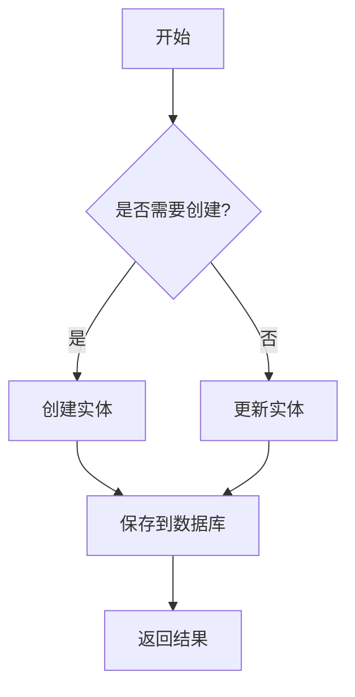
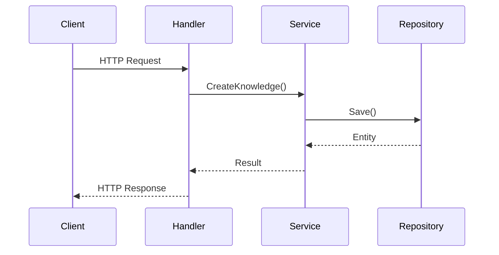
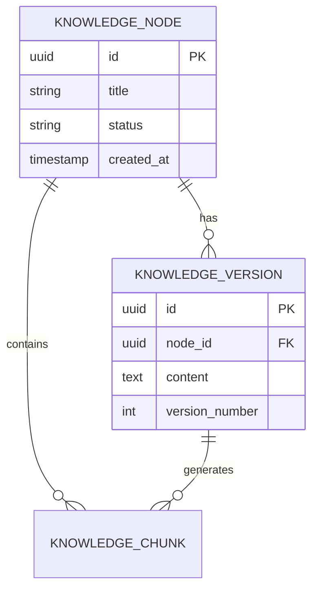

# 文档编写规范

## 格式要求

### Markdown 格式

所有项目文档必须使用 **Markdown** 格式编写（`.md` 文件）。

### 图表绘制

使用 **Mermaid** 语法绘制图表，支持的图表类型包括：

- 流程图 (Flowchart)
- 时序图 (Sequence Diagram)
- 类图 (Class Diagram)
- 状态图 (State Diagram)
- ER 图 (Entity Relationship Diagram)
- 甘特图 (Gantt Chart)

#### 示例：流程图

#### 示例：时序图

#### 示例：ER 图

## 编写原则

- **简洁明了**：避免冗长和重复
- **结构清晰**：使用标题层级组织内容
- **代码示例**：关键概念提供代码示例
- **图文并茂**：复杂流程使用 Mermaid 图表说明
