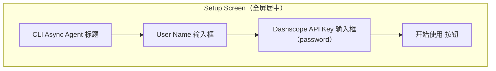
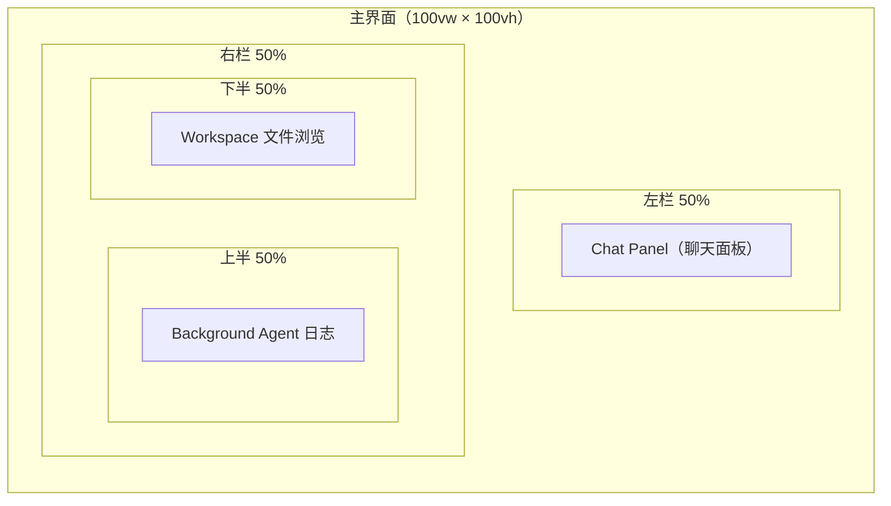
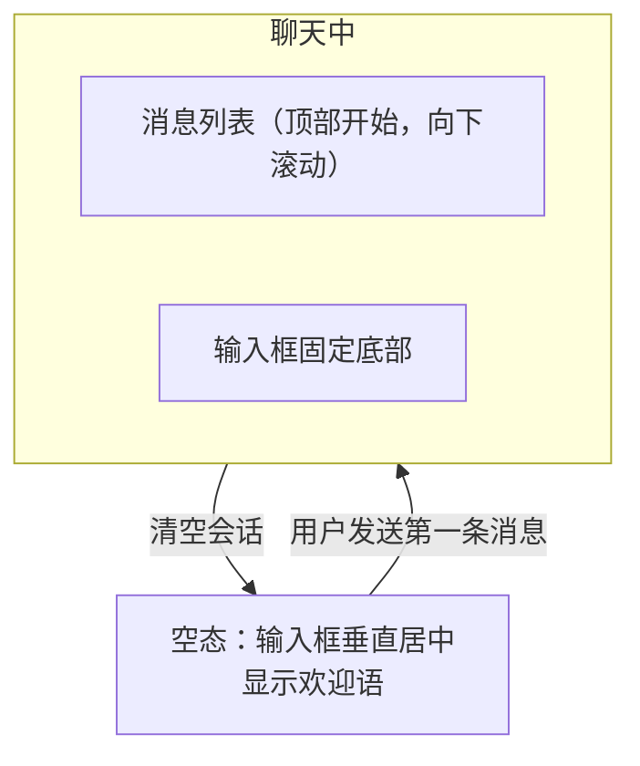
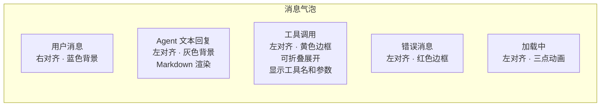
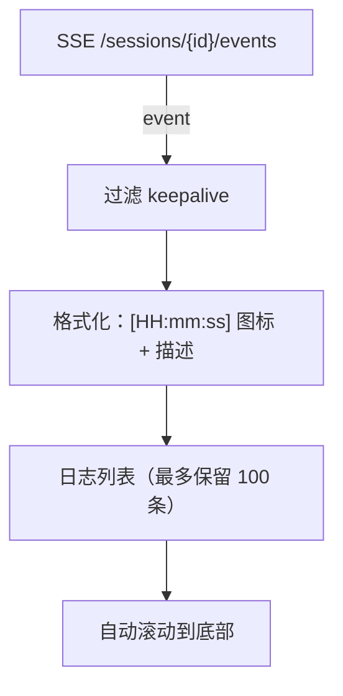
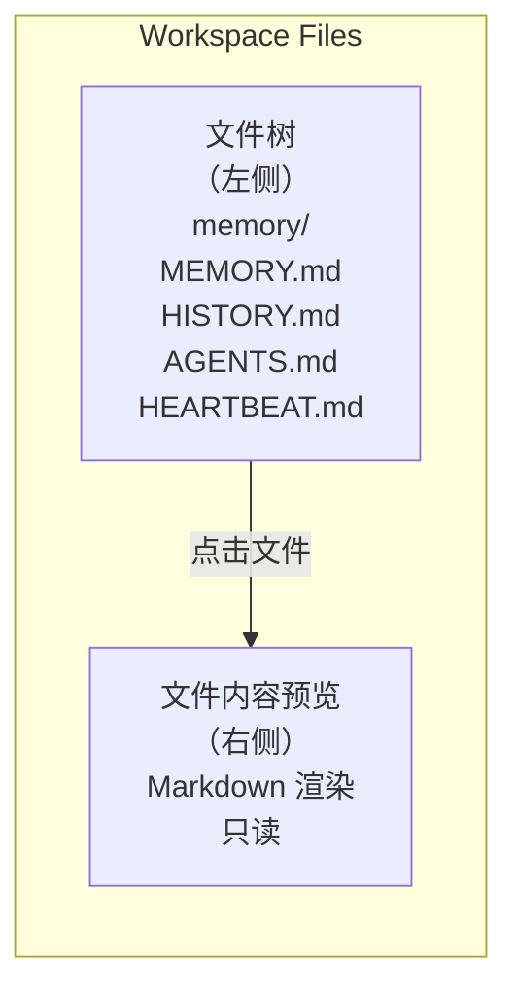
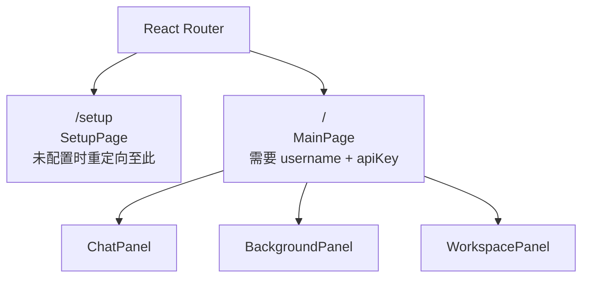
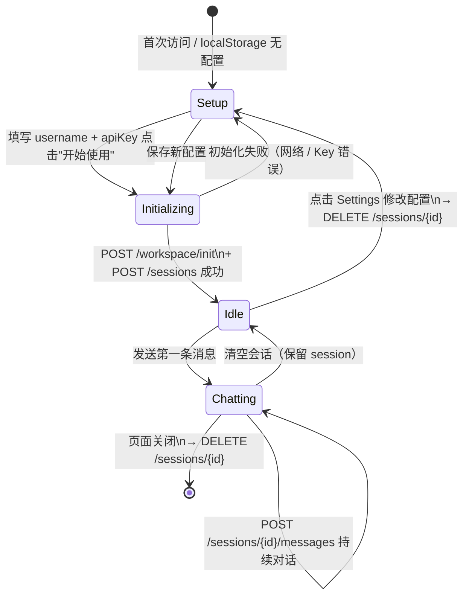
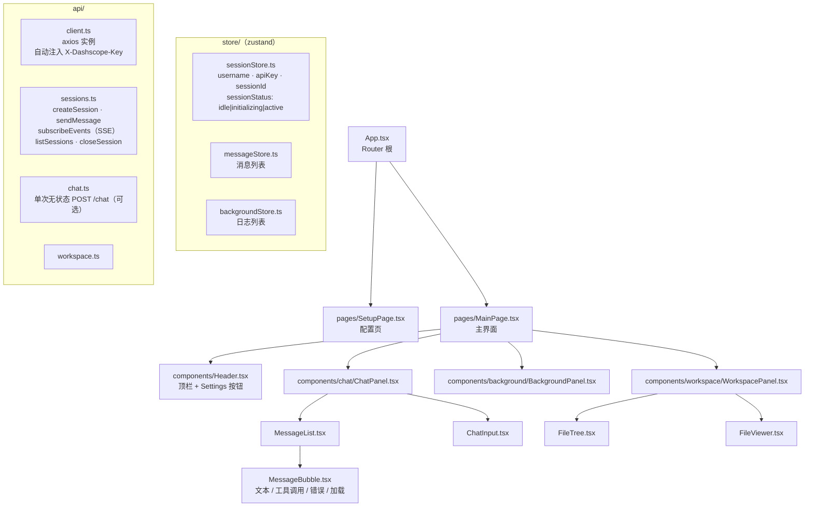

# 前端页面设计文档

## 1. 整体布局

### 1.1 启动前（Setup Screen）

用户未配置 API Key 时，全屏显示设置面板。



- API Key 输入框为 `type="password"`
- 点击"开始使用"后按顺序执行：
  1. `POST /workspace/init?user={username}` — 初始化用户工作区（幂等）
  2. `POST /sessions` — 创建并启动持久 session（AgentLoop + BackgroundAgent 就绪）
- 返回的 `session_id` 连同 username、API Key 一起存入 `localStorage`
- 刷新页面后：若 `session_id` 仍存在（`GET /sessions` 验证）则直接恢复；否则重新创建 session
- 页面右上角提供 Settings 按钮可随时修改配置（修改后关闭旧 session、创建新 session）
- 页面卸载时（`beforeunload`）调用 `DELETE /sessions/{id}` 关闭 session

---

### 1.2 主界面布局（Main Screen）



---

## 2. 聊天面板（左栏）

### 2.1 聊天状态流



### 2.2 消息气泡类型



> **注：** 当前 `/chat` 接口返回最终文本，工具调用过程暂不透传。后续扩展 SSE 流式接口后可实时展示工具调用步骤。

### 2.3 输入框行为

- `Enter` 发送，`Shift+Enter` 换行
- 发送期间禁用输入框，显示加载动画
- 多行自动扩展高度，最大 5 行

---

## 3. Background Agent 面板（右栏上半）

通过 SSE 实时订阅 BackgroundAgent 的分析事件，格式为 `[时间戳] 动作描述`，自动滚动到最新一条。

### 3.1 SSE 连接

session 创建成功后立即建立 SSE 连接：

```js
const es = new EventSource(`/sessions/${sessionId}/events`);
es.onmessage = (e) => {
  const event = JSON.parse(e.data);
  if (event.type !== "keepalive") appendBGLog(event);
};
es.onerror = () => { /* 断线重连 */ };
```

session 关闭（`DELETE /sessions/{id}`）时调用 `es.close()`。

### 3.2 事件类型

| `type` | 含义 | 关键字段 |
|--------|------|----------|
| `start` | 开始分析本轮对话 | `session`, `message`（用户消息前 120 字）|
| `tool_call` | 正在调用工具 | `detail`（工具名 + 参数摘要）|
| `tools_used` | 本轮使用的工具汇总 | `tools`（数组）|
| `hint` | 生成 ephemeral hint | `hint`（字符串）|
| `done` | 分析完成 | `tools_used`（数组）|
| `consolidate` | 触发记忆压缩 | `session` |
| `keepalive` | 队列空闲心跳（15s） | — |

### 3.3 面板展示逻辑



事件图标建议：
- `start` → 🔍
- `tool_call` → 🛠
- `tools_used` → ✅
- `hint` → 💡
- `consolidate` → 🗂
- `done` → ✓（灰色，不显示）

---

## 4. Workspace 文件面板（右栏下半）



- 调用 `GET /workspace/files?user=` 获取递归文件树，节点含 `readable` 字段标识是否可预览
- 点击 `readable: true` 的文件调用 `GET /workspace/files/{path}?user=` 获取内容
- 支持预览格式：`.md`（Markdown 渲染）、`.txt`、`.json`、`.jsonl`（纯文本）
- 只读，不提供编辑功能
- 每次 Agent 回复后自动刷新文件树

---

## 5. 技术选型

| 层 | 选型 |
|----|------|
| 框架 | React 18 + TypeScript |
| 构建工具 | Vite |
| 样式 | Tailwind CSS |
| 路由 | React Router v6 |
| Markdown 渲染 | `react-markdown` + `highlight.js` |
| HTTP 客户端 | `axios` |
| 状态管理 | `zustand` |
| 持久化 | `localStorage` |

---

## 6. API 接口说明

所有需要 API Key 的接口必须携带 Header：`X-Dashscope-Key: sk-xxxxxxxx`

---

### `POST /workspace/init`

初始化用户工作区，首次进入时调用。

**Query 参数**

| 参数 | 类型 | 必填 | 说明 |
|------|------|------|------|
| `user` | string | 否 | 用户名，默认 `default` |

**返回**

```json
{
  "workspace": "/app/workspaces/alice",
  "created": ["AGENTS.md", "SOUL.md", "memory/MEMORY.md"]
}
```

---

### `POST /chat`

无状态单次对话。Persona 模型立即响应，BackgroundAgent 在响应返回后异步分析并更新记忆文件。

适用于无需持久 session 的简单场景；多轮对话建议使用 `/sessions`。

**Header**：`X-Dashscope-Key`（必填）

**请求体**

```json
{
  "message": "你好",
  "user": "alice",
  "session_id": "session-1"
}
```

| 字段 | 类型 | 必填 | 说明 |
|------|------|------|------|
| `message` | string | 是 | 用户消息内容 |
| `user` | string | 否 | 用户名，默认 `default` |
| `session_id` | string | 否 | 会话 ID，不传则自动生成 `api:{user}` |

**返回**

```json
{
  "response": "你好！有什么可以帮你？",
  "session_id": "session-1"
}
```

---

### `POST /sessions`

创建并启动持久 session（AgentLoop + BackgroundAgent 同时运行）。

**Header**：`X-Dashscope-Key`（必填）

**请求体**

```json
{
  "user": "alice",
  "session_id": "alice-main"
}
```

| 字段 | 类型 | 必填 | 说明 |
|------|------|------|------|
| `user` | string | 否 | 用户名，默认 `default` |
| `session_id` | string | 否 | 自定义 session ID，不传则自动生成 `api:{user}` |

**返回**

```json
{
  "session_id": "alice-main",
  "workspace": "/app/workspaces/alice"
}
```

**错误码**

| 状态码 | 原因 |
|--------|------|
| 409 | session_id 已存在，需先 DELETE |

---

### `POST /sessions/{session_id}/messages`

向活跃 session 发送消息，等待 persona 响应。BackgroundAgent 并行分析，更新 `MEMORY.md` / `USER.md`。

**Header**：`X-Dashscope-Key`（必填）

**请求体**

```json
{
  "message": "我叫 Jay，你呢？",
  "timeout": 60.0
}
```

| 字段 | 类型 | 必填 | 说明 |
|------|------|------|------|
| `message` | string | 是 | 用户消息内容 |
| `timeout` | float | 否 | 等待超时秒数，默认 60 |

**返回**

```json
{
  "session_id": "alice-main",
  "response": "Jay，好名字。"
}
```

**错误码**

| 状态码 | 原因 |
|--------|------|
| 404 | session 不存在 |
| 504 | Agent 响应超时 |

---

### `GET /sessions/{session_id}/events`

SSE 流，推送 BackgroundAgent 分析事件。

**响应 Content-Type**：`text/event-stream`

每条 SSE 数据为 JSON 对象，详见第 3.2 节事件类型表。

连接保持直到客户端断开；服务端每 15 秒发送一条 `keepalive` 事件防止超时。

**错误码**

| 状态码 | 原因 |
|--------|------|
| 404 | session 不存在 |

---

### `GET /sessions`

列出所有当前活跃的 session ID。

**返回**

```json
{ "sessions": ["alice-main", "bob-session"] }
```

---

### `DELETE /sessions/{session_id}`

关闭 session，停止 AgentLoop 和 BackgroundAgent，会话历史自动持久化到 workspace。

**返回**

```json
{ "closed": "alice-main" }
```

**错误码**

| 状态码 | 原因 |
|--------|------|
| 404 | session 不存在 |

---

### `POST /heartbeat`

手动触发一次心跳，Agent 读取 `HEARTBEAT.md` 并执行其中任务。

**Header**：`X-Dashscope-Key`（必填）

**Query 参数**

| 参数 | 类型 | 必填 | 说明 |
|------|------|------|------|
| `user` | string | 否 | 用户名，默认 `default` |

**返回**

```json
{
  "result": "已完成任务：检查日程"
}
```

---

### `GET /workspace/files`

返回用户工作区的递归文件树。

**Query 参数**

| 参数 | 类型 | 必填 | 说明 |
|------|------|------|------|
| `user` | string | 否 | 用户名，默认 `default` |

**返回**

```json
{
  "user": "alice",
  "tree": [
    {
      "name": "memory",
      "path": "memory",
      "type": "dir",
      "children": [
        { "name": "MEMORY.md", "path": "memory/MEMORY.md", "type": "file", "readable": true },
        { "name": "HISTORY.md", "path": "memory/HISTORY.md", "type": "file", "readable": true }
      ]
    },
    { "name": "AGENTS.md", "path": "AGENTS.md", "type": "file", "readable": true }
  ]
}
```

`readable: true` 表示该文件可调用内容接口预览（`.md/.txt/.json/.jsonl`）。

---

### `GET /workspace/files/{file_path}`

获取单个文件的文本内容。

**路径参数**

| 参数 | 说明 |
|------|------|
| `file_path` | 相对于 workspace 根目录的路径，如 `memory/MEMORY.md` |

**Query 参数**

| 参数 | 类型 | 必填 | 说明 |
|------|------|------|------|
| `user` | string | 否 | 用户名，默认 `default` |

**返回**

```json
{
  "path": "memory/MEMORY.md",
  "content": "# Long-term Memory\n\n- 用户喜欢简洁风格",
  "suffix": ".md"
}
```

**错误码**

| 状态码 | 原因 |
|--------|------|
| 403 | 路径包含 `../`，尝试访问 workspace 外部 |
| 404 | 文件不存在 |
| 413 | 文件超过 512KB |
| 415 | 文件类型不支持（非 `.md/.txt/.json/.jsonl`） |

---

### `GET /health`

服务健康检查，无需 API Key。

**返回**

```json
{ "status": "ok" }
```

---

## 7. 路由结构



路由守卫逻辑：访问 `/` 时检查 `localStorage`，若无 username 或 apiKey 则重定向到 `/setup`。

---

## 8. 状态流转



---

## 9. 组件结构


